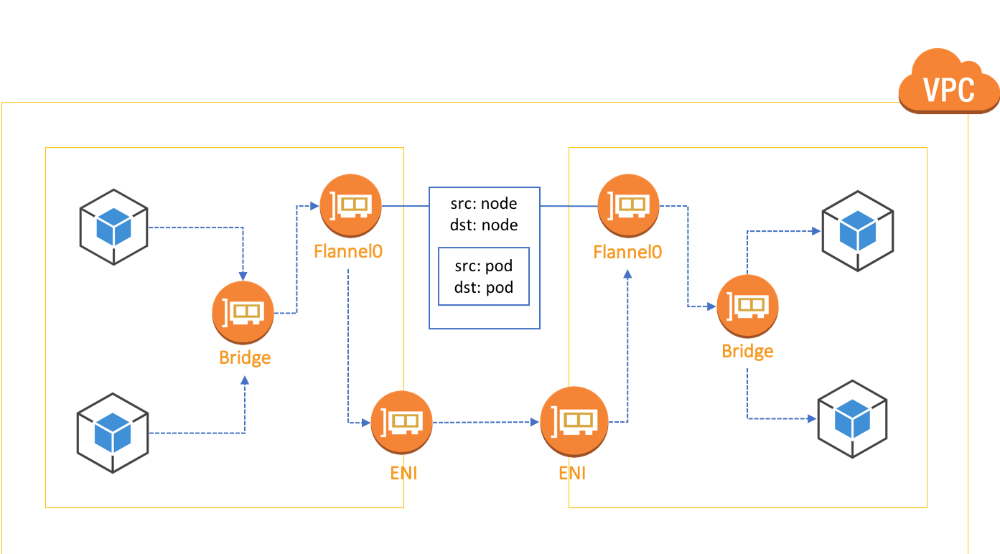

:toc:
:icons:
:linkattrs:

= Networking tips

=== Kubnet 

kubenet is a simple and basic network provider there does not implement any advanced functionality, like cross-node networking, instead it relies on the underlying VPC fabric for by adding routes to the VPC route table for each cluster node. 

 

Because there is a limit of 50 rules per route table, if you plan on deploying a cluster with more than 50 nodes, you may want to consider other options.

=== Ovelay Networks

Overlay network, as well as providing an mechanism to scale your kubernetes cluster beyond 50 nodes, also help address other constraints. Imagine a situation where you’ve scaled your vpc to accommodate for hundreds of EC2 instances, and not thousands of containers. By implementing an overlay network the pool of available IP address that can be assigned to the containers increases significantly.

In addition to that, overlay many overlay networks implement more advanced functionality like network policies, which can be used to help segregate our containers.

Lets take a how a simple overlay network is implemented using **Flannel**.

==== Demo Steps.
=====  
- Each pod in the cluster is allocated an IP address from a cluster wide pool of IPs. 
- Every time a new pod starts, it is assigned an IP from that pool. 
- A mapping between the pods IP and ip address of the EC2 instance the pod is running on is written to etcd, via the Kubernetes API.
- When a pod on one nodes needs to communicate with a pod on another node, the packets from the source pod are first encapsulated using, typically, the VXLAN encapsulation protocol, and moved on to the VPC. 
- The VPC fabric routes the packet to the correct node. Once there packet is the packet is de-encapsulated and forwarded to the correct pod.

=====

Flannel makes implementing an overlay network relatively simple, however there are some drawbacks. The added overhead of packet encapsulation may introduce some latency, and this is something to be mindful of, especially as you scale you cluster. Flannel also does not support advanced features like network policies. 

=== VPC Native Kubernetes networking

